# 🌟 Magical Tirupati – Your Ultimate Travel Companion 🛕

Welcome to **Magical Tirupati**, a comprehensive and immersive travel guide designed for pilgrims, tourists, and wanderers exploring the divine and culturally rich city of **Tirupati**. This website is crafted to provide a seamless and enriching experience for users seeking information, guidance, and resources related to travel and stay in and around **Tirumala**.

---

## 🧭 About the Website

**Magical Tirupati** aims to be a **one-stop platform** offering:

- 📌 Verified **temple information** with historical significance  
- 🏨 Listings of **hotels** ranging from budget to luxury  
- 🍽️ Local and popular **restaurants**  
- 🌄 Major **tourist attractions**  
- 🛵🚗 **Bike and car rental services** near Tirumala  

Each section is curated with **meticulous attention to detail**, combining local insights with practical information to enhance your travel experience.

---

## 🏠 Homepage Overview (`homepage.html`)

Start your journey by exploring the **homepage**. It acts as the central navigation dashboard for all categories. From there, you can easily explore:

- 🛕 Temples near Tirumala  
- 🏨 Hotels for accommodation  
- 🍽️ Restaurants for dining  
- 🌄 Popular tourist spots  
- 🛵🚗 Rental services (bike/car) for transportation  

Every button or link leads you to a dedicated section for deeper exploration.

---

## 📄 Subpages & Features

Each subpage is designed with clarity and usefulness in mind, and includes:

### 🛕 Temples
- Detailed **history** of each temple  
- **Location mapping** via embedded Google Maps  
- **Nearby facilities** (restaurants, hotels, rentals)  
- **Spiritual insights** and cultural significance  

### 🏨 Hotels
- Listings of **top-rated hotels** near Tirumala  
- Image previews with **facility details**  
- **Map embeds** for location and directions  
- Links to **nearby attractions or services**  

### 🍽️ Restaurants
- Local and regional **dining options**  
- Cuisines served, specialties, and pricing  
- Cleanliness and **customer ratings**  
- Location maps embedded with Google Maps  

### 🏞️ Tourist Attractions
- Description of **scenic and cultural places** around Tirupati  
- Entry timing, ticket cost, and best visiting seasons  
- Image previews and **geographical context**  

### 🛵🚗 Bike/Car Rentals
- Providers offering **bike and car rentals** near Tirumala  
- Contact info, vehicle types, and rental rates  
- Interactive map for **easy navigation**  

Each subpage also includes:

- 🌦️ **Weather and climate info**  
- 🗺️ Nearby facilities (restaurants, hotels, etc.)  
- 📍 Fully functional **embedded Google Maps**

---

## 🖼️ Image Gallery

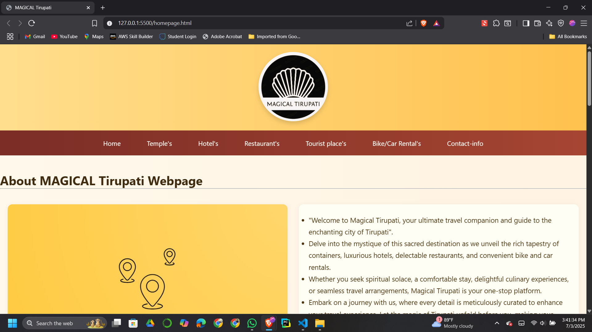
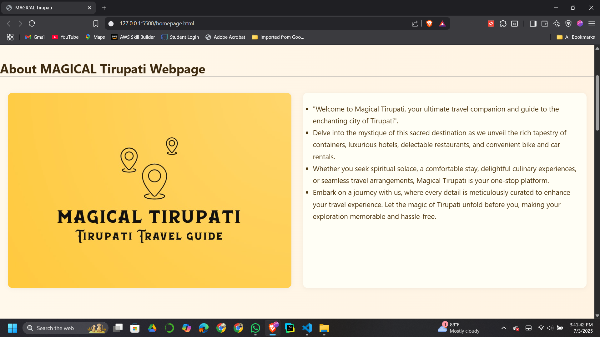
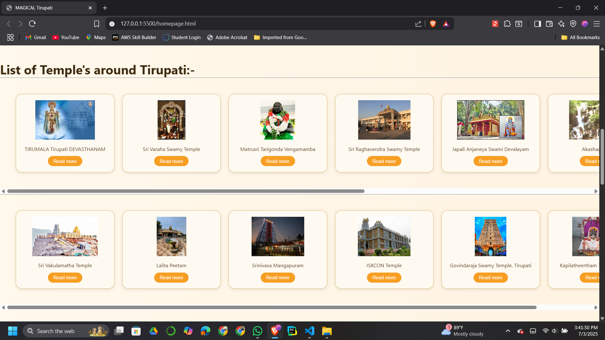
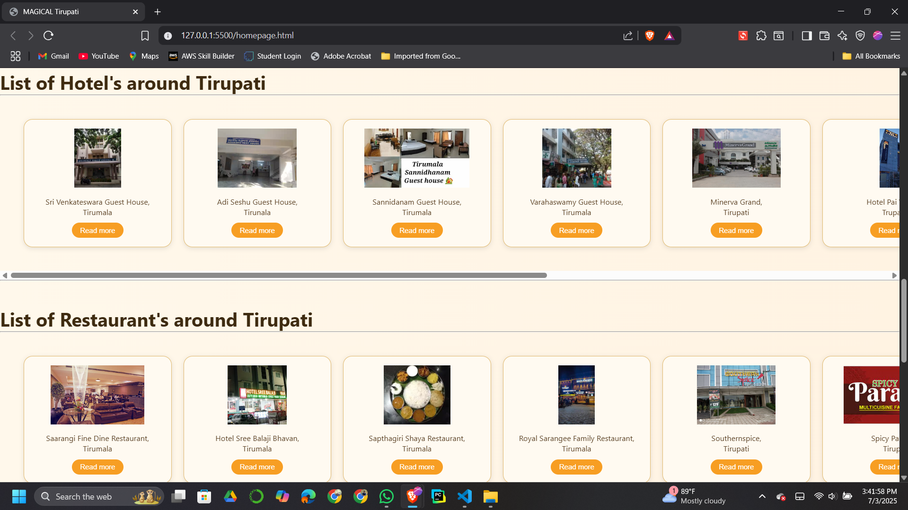
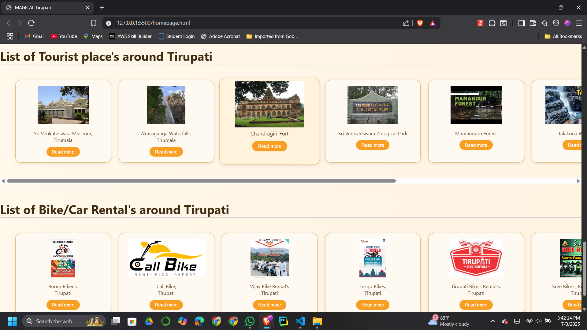
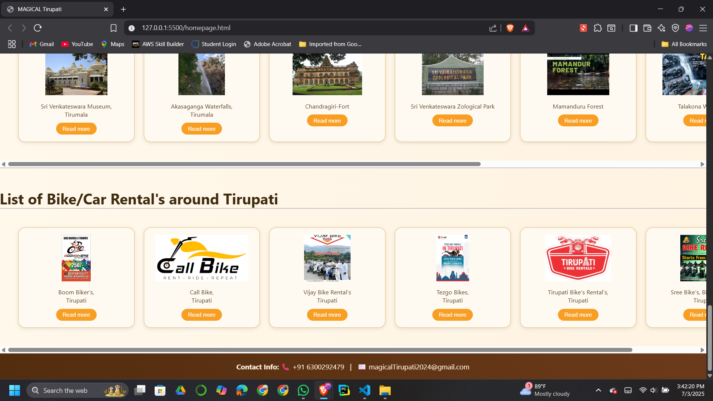
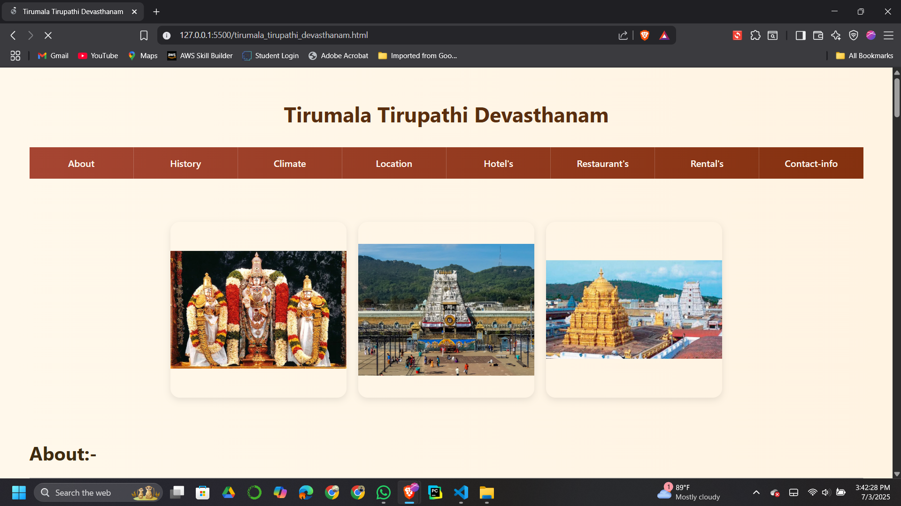
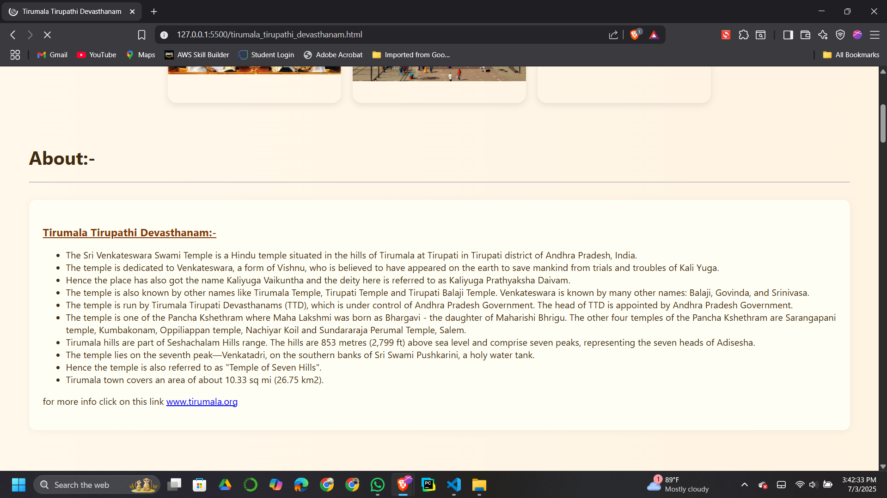
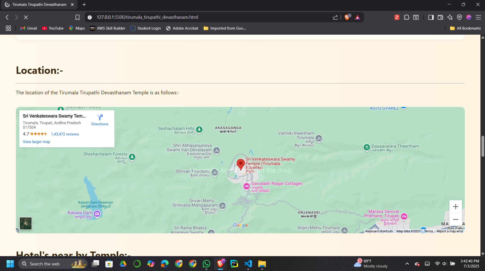
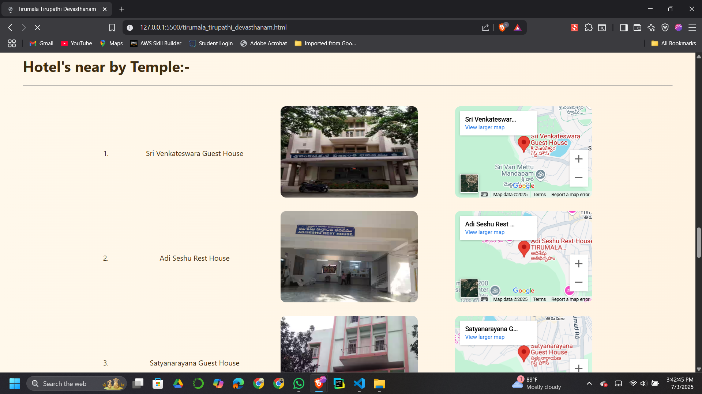
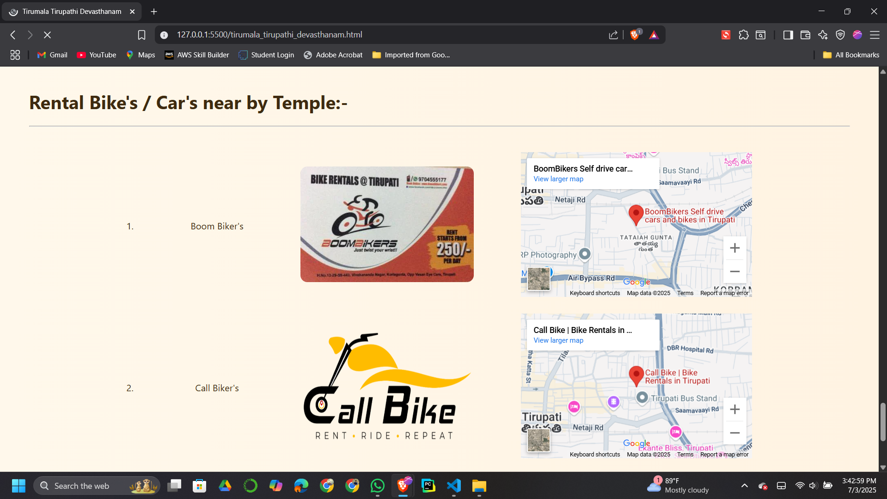

These images visually support the content and showcase:

- 🛕 Temples and spiritual places  
- 🏨 Hotel exteriors and interiors  
- 🍽️ Local cuisine and restaurant ambiance  
- 🛵🚗 Rental stations and vehicle types  
- 🏞️ Tourist landmarks and local environment  

These visuals give users a **realistic preview** of what to expect when visiting.

---

## 💡 Key Highlights

- ✅ Fully responsive and **user-friendly design**  
- 🗺️ Embedded **Google Maps** for real-time navigation  
- 🧑‍🎨 Professional layout with clean typography and visual balance  
- 📂 Organized categorization of information  
- 🔗 Smooth HTML navigation structure  

---

## 🧑‍💻 Developer Information

| Field       | Detail                                      |
|-------------|----------------------------------------------|
| **Name**    | Sai Reddy                                    |
| **Email**   | jadasaiganesh@gmail.com                      |
| **GitHub**  | [github.com/jadasaiganesh](https://github.com/jadasaiganesh) |

> This project is designed and developed with care, love for Tirupati, and a passion for clean, user-centric web experiences.

---

## 🚀 How to Use

1. **Open** `homepage.html` in any modern web browser.  
2. **Navigate** to any section of your interest.  
3. Explore each location with:
   - 🖼️ Visuals  
   - 📖 History  
   - 🗺️ Location map  
   - 🏨 Nearby amenities  

It’s that simple — **Magical Tirupati** brings everything under one digital roof.

---

## 🌐 Ideal For

- 🙏 Devotees visiting Tirumala/Tirupati  
- 🧳 First-time tourists  
- 🏡 Local travelers seeking convenience  
- 🚌 Event planners and travel groups  

---

## 🙌 Thank You

Thank you for visiting **Magical Tirupati**. Whether you're here for pilgrimage, adventure, or relaxation, this guide is built to make your journey **smooth, spiritual, and memorable**.

> **Let the magic of Tirupati unfold before you...**

---
